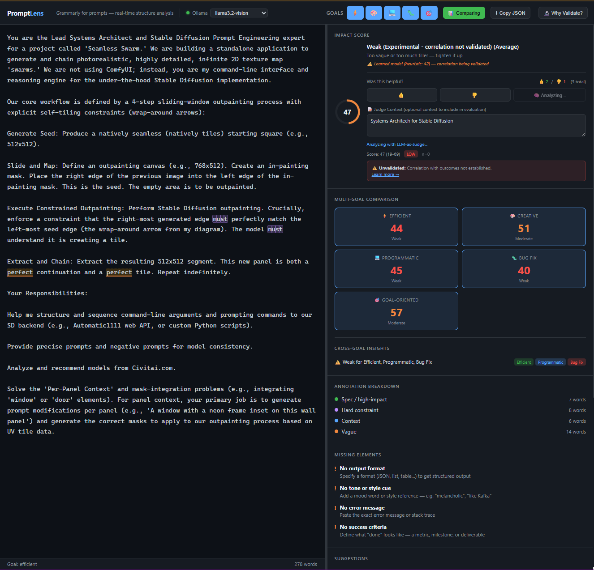

# PromptLense 🔍

**Real-Time Prompt Structure Analyzer for LLMs**

[](./)
[](./LICENSE)
[](./)

PromptLense is a browser-based tool that analyzes LLM prompts in real-time, providing instant feedback on prompt structure, quality scoring, and optimization suggestions across multiple goals.



## ✨ Features

### Core Capabilities
- **🔍 Pattern Detection** - Identifies high-impact words, constraints, filler words, and context clues
- **📊 Quality Scoring** - Real-time heuristic scoring across 74+ regex patterns
- **🎯 Multi-Goal Analysis** - Compare prompts across 5 optimization goals:
  - **Efficient** - Minimize tokens while preserving intent
  - **Creative** - Maximize evocative, aesthetic language
  - **Programmatic** - Optimize for code generation
  - **Bug Fix** - Focus on debugging and error correction
  - **Goal-Oriented** - Emphasize task completion clarity
- **🔄 Compare Mode** - Side-by-side scoring across all goals simultaneously

### Feedback & Data
- **👍/👎 Feedback System** - One vote per prompt, tracked locally with full validation history
- **Local Storage** - All data stays on your device with quota management and shape validation

### AI Integration (Optional)
- **Ollama Support** - AI-powered LLM-as-Judge scoring via local Ollama instance
- **Model Load/Unload Controls** - Explicit load and unload buttons; no model auto-loads without your action
- **Model Memory Info** - Shows each model's size in GB vs your system RAM before loading
- **Bias Mitigation** - Position swap and multi-sample aggregation for fair judging

## 🚀 Quick Start

### Option 1: Direct Open (No Ollama)
Double-click `PromptLense.html` — opens directly in your browser. All core analysis features work immediately. Ollama integration will show as offline.

### Option 2: With Ollama Support (Recommended)
```bash
# Double-click start.bat
# This starts an HTTP server on port 8080 and launches Ollama with CORS enabled
start.bat
```

Then open your browser to `http://localhost:8080/PromptLense.html`

> **Note:** If you open `PromptLense.html` directly via `file://`, browsers block requests to `localhost` (CORS). Use `start.bat` or serve it yourself with `python -m http.server 8080`.

## 📁 Project Structure

```
PromptLense/
├── 📄 PromptLense.html      # Main application (self-contained)
├── ⚡ start.bat             # Windows launcher — HTTP server + Ollama with CORS
├── 📖 README.md             # This file
├── 📋 PROJECT-REPORT.md     # Detailed project documentation
├── 📁 docs/                 # Documentation & research
│   ├── deployment-guide.md
│   ├── ollama-troubleshooting.md
│   ├── v1.2-setup-guide.md
│   └── assets/
│       └── screenshot.png
├── 📁 src/                  # Source files & components
│   ├── llm-judge-integration.js
│   └── validation-demonstration.html
└── 📁 debug/                # Development & debug files
    ├── swarm-state.json
    └── fixes-applied.md
```

## 🖥️ System Requirements

- **Browser**: Chrome 80+, Firefox 75+, Safari 13+, Edge 80+
- **Storage**: ~5 MB for application + feedback data
- **Optional**: Ollama (for AI-powered analysis)

## 📊 What Gets Analyzed

| Category | Examples | Detection |
|----------|----------|-----------|
| **High-Impact Words** | `explain`, `step-by-step`, `analyze` | ✅ Pattern matching |
| **Constraints** | `"exact phrase"`, `max 500 words` | ✅ Regex extraction |
| **Filler Words** | `please`, `could you`, `very` | ✅ 40+ patterns |
| **Context Clues** | `@python`, `@creative`, `@formal` | ✅ 600+ vocabulary |
| **Format Specs** | `JSON`, `markdown table`, `bullet list` | ✅ 25+ formats |

## 🧠 How It Works

1. **Real-time Analysis** - As you type, PromptLense analyzes your prompt using 74+ regex patterns
2. **Scoring Algorithm** - Heuristic scoring weighted by annotation type (constraint, high-impact, vague, filler, context)
3. **Goal Comparison** - Switch between 5 optimization goals to see different recommendations
4. **LLM-as-Judge** - Optionally route your prompt through a local Ollama model for deeper qualitative scoring

## 🔧 Ollama Integration

To enable AI-powered analysis:

```bash
# 1. Install Ollama
# https://ollama.com/download

# 2. Pull a model
ollama pull llama3.2

# 3. Launch PromptLense with Ollama support
start.bat
```

In the app:
- Select your model from the dropdown (each model shows its size in GB)
- Check the memory indicator — it compares model size to your system RAM
- Click **Load** to load the model into memory
- Click **Judge** to run LLM-as-Judge scoring on your prompt
- Click **Unload** when done to free memory

See [Ollama Troubleshooting](./docs/ollama-troubleshooting.md) for CORS setup and common issues.

## 📖 Documentation

- **[Deployment Guide](./docs/deployment-guide.md)** - How to share and deploy PromptLense
- **[Setup Guide](./docs/v1.2-setup-guide.md)** - Detailed installation instructions
- **[Ollama Troubleshooting](./docs/ollama-troubleshooting.md)** - Common issues and solutions
- **[Project Report](./PROJECT-REPORT.md)** - Architecture, metrics, and roadmap

## 🤝 Contributing

Feedback and contributions welcome.

1. Fork the repository
2. Create a feature branch
3. Make your changes
4. Submit a pull request

## 📜 License

MIT License - Feel free to use, modify, and distribute.

## 🙏 Acknowledgments

- Built with vanilla JavaScript — no frameworks, no dependencies
- Inspired by prompt engineering research from OpenAI, Anthropic, and the broader AI community
- Ollama integration for local LLM analysis

---

**Version**: 1.3.0
**Last Updated**: March 2026
**Status**: Production-Ready Beta
